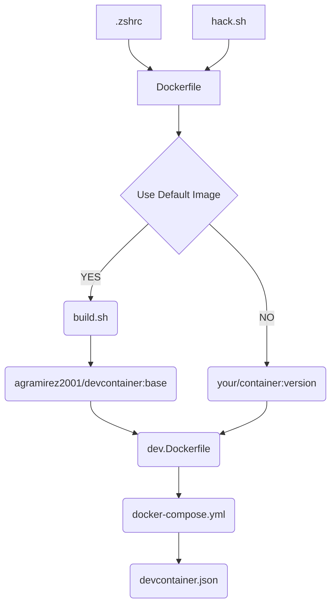

# Dev Containers
These are useful docker images setup for various types of software development.  While they can be used alone in docker containers, it is recommended that they are used with VSCode and DevContainers so that a unified local development environment can be shared accross development teams.

## [Base Container](01-base/)
This useful container contains basic tools like wget, curl, and others.  It also contains the [Rocq Theorem Prover](https://rocq-prover.org/) and [LaTex](https://www.latex-project.org/) which both take FOREVER to build, which is why they are included in this base image.  Other images can build off this one without having to download and install these components on every build.

> A published version of the image can be found in dockerhub at [agramirez2001/devcontainer:base](https://hub.docker.com/repository/docker/agramirez2001/devcontainer/general).

Here is a dependency diagram of how the files in the [01-base/](01-base/) directory depend on each other--from top to bottom.

The [.zshrc](01-base/.zshrc) and [hack.sh](01-base/hack.sh) files are required by Rocq and for the Opam setup.

The [Dockerfile](01-base/Dockerfile) contains all of the setup for installing the base tools.  

The [build.sh](01-base/buid.sh) is just a convenience script to build and publish the base image to the [agramirez2001](https://hub.docker.com/repositories/agramirez2001) github repo--it should not be used.

The [dev.Dockerfile](01-base/dev.Dockerfile) uses the [agramirez2001/devcontainer:base](https://hub.docker.com/repository/docker/agramirez2001/devcontainer/base) image.

The [docker-compose.yml] file uses the [dev.Dockerfile](01-base/dev.Dockerfile) image, which is expected to be customized with specific tools such as Rust, Python, Erlang, etc.

Finally, the [devcontainer.json](01-base/devcontainer.json) contains a template dev container file for VSCode.  It installs some useful extensions, calls the docker-compose.yml file, and starts the development environment where everything is installed.